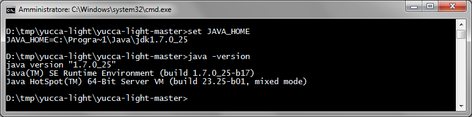

WORK IN PROGRESS
=============

yucca-light (Yucca portable gateway )
=============


Yucca-light allows you to easily integrate intelligent objects with a platform yucca (as www.smartdatanet.it ) even when you have network discontinuity


First version of Yucca-Light
----------------------------

* Gateway functionality to mediate smart objects and Yucca platform (as www.smartdatanet.it)
* Web console to managed and view gatewat status
* Autoconfiguration from Yucca platform (as www.smartdatanet.it)
* Run with embedded Tomcat or in external Tomcat
* Run with embedded or external ActiveMQ

Getting started
---------------

To use yucca-light you must follow these steps:

1. Choose if you want costumize & build code or just download
2. Choose if you want run as standalone (using tomcat embedded) or install on tomcat 8
3. Build or download correct release
4. Configure properties (see [Properties]( PROPERTIES.md))
5. Run from shell or deploy on tomcat 8

yucca-light is a [Spring boot application](http://projects.spring.io/spring-boot/), you can code or use all spring boot capabilities.

### Build from source
Software required: **Maven 3.2+**, **jdk 1.7.x**

1. Clone or download source on your computer
2. Check if the environment variable **JAVA_HOME** is properly set with the **jdk 1.7.x** 
3. Build with **maven** using the command `mvn clean install -DskipTests`
4. The expected result of the build is the file **target/yucca-light.war**

#### Screenshots
** check java version **



** build start**


** build end **


### Configure (how to enable autoconfiguration from Yucca Platform)
All configurations are set in a file outside the war  (see [Properties]( PROPERTIES.md))

At the startup, Yucca-light automatically download all the stream configurations related to the tenant configured, from the platform yucca.

Only streams persisted are retreives from Yucca. Streams without associated dataset are not managed from yucca-light 

### Run standalone (using Tomcat embedded)
1. Check if the environment variable **JAVA_HOME** is properly set with the **jdk 1.7.x** 
2. Configure the **application.properties** (see [Properties]( PROPERTIES.md))
3. Exec the command `java -jar yucca-light.war`
4. Open in a browser the url http://localhost:8080/yucca-light/console and login with the configured credentials. 

#### Screenshots
** yucca-light starting... **


** yucca-light ready... **


** web console... **


If you get the error ** org.springframework.context.ApplicationContextException: You have configuration problem ** be sure to have configurated the **application.properties** with mandatory properties.


### Deploy on tomcat 8 and run as web application
The generated war on tomcat 8 is ready to be deployed under **tomcat 8**.
 
Before deploy is necessary to configure tomcat (see [Properties]( PROPERTIES.md)).

To  lighten the war is possible to remove the folder **lib-provided** under **yucca-light.war->WEB-INF**


### Run with embedded or external ActiveMQ

In order to run yucca-light using an external ActiveMQ you must configure these properties in your properties file
```
spring.activemq.broker-url
spring.activemq.user
spring.activemq.password
``` 

for example default configuration for ActiveMQ works with:
```
spring.activemq.broker-url=tcp://localhost:61616
spring.activemq.user=system
spring.activemq.password=manager
``` 

Yucca-light detect external broker url and doesn't start internal ActiveMQ.


### Run with embedded or external ActiveMQ

In order to run yucca-light using an external ActiveMQ you must configure these properties in your properties file
```
spring.activemq.broker-url
spring.activemq.user
spring.activemq.password
``` 

for example default configuration for ActiveMQ works with:
```
spring.activemq.broker-url=tcp://localhost:61616
spring.activemq.user=system
spring.activemq.password=manager
``` 

Yucca-light detect external broker url and doesn't start internal ActiveMQ.

How it works
---------------

### Web console
TBD


### Sending messages in HTTP or MQTT
TBD

### What happens when there is a network error?
TBD


