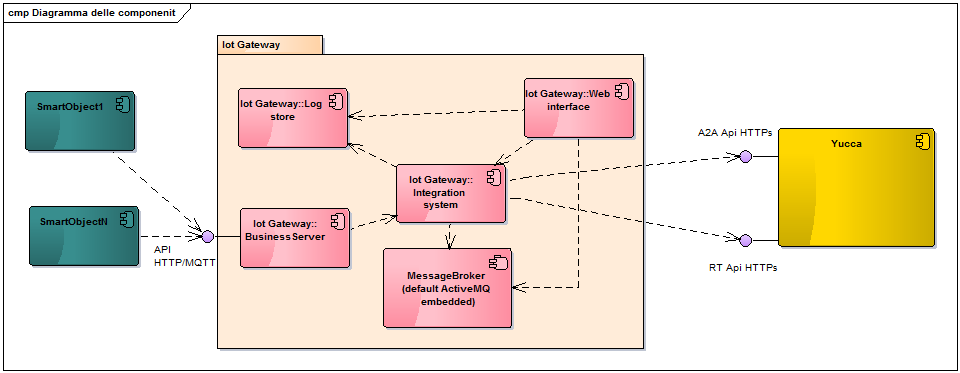

yucca-light (Yucca portable gateway )
=============

Yucca-light allows you to easily integrate intelligent objects with a platform yucca (as www.smartdatanet.it ) even when you have network discontinuity

First version of Yucca-Light
----------------------------

* Gateway functionality to mediate smart objects and Yucca platform (as www.smartdatanet.it)
* Web console to managed and view gatewat status
* Autoconfiguration from Yucca platform (as www.smartdatanet.it)
* Run with embedded Tomcat or in external Tomcat
* Run with embedded or external ActiveMQ

Getting started
---------------

To use yucca-light you must follow these steps:

1. Choose if you want costumize & build code or just download
2. Choose if you want run as standalone (using tomcat embedded) or install on tomcat 8
3. Build or download correct release
4. Configure properties (see [Properties]( PROPERTIES.md))
5. Run from shell or deploy on tomcat 8

